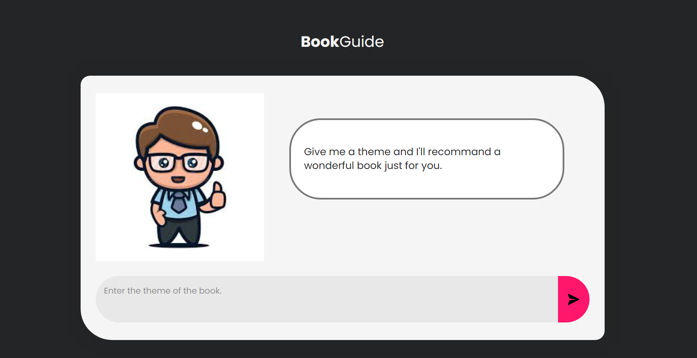

Book-Recommendation-using-ChatGPT 
This is a website created using HTML, CSS and JavaScript that sends API requests to openAI in order to recommend books to the user after they provide a theme. 
The output includes: 
AI generated picture 
Title 
Author Name 
Synopsis 

